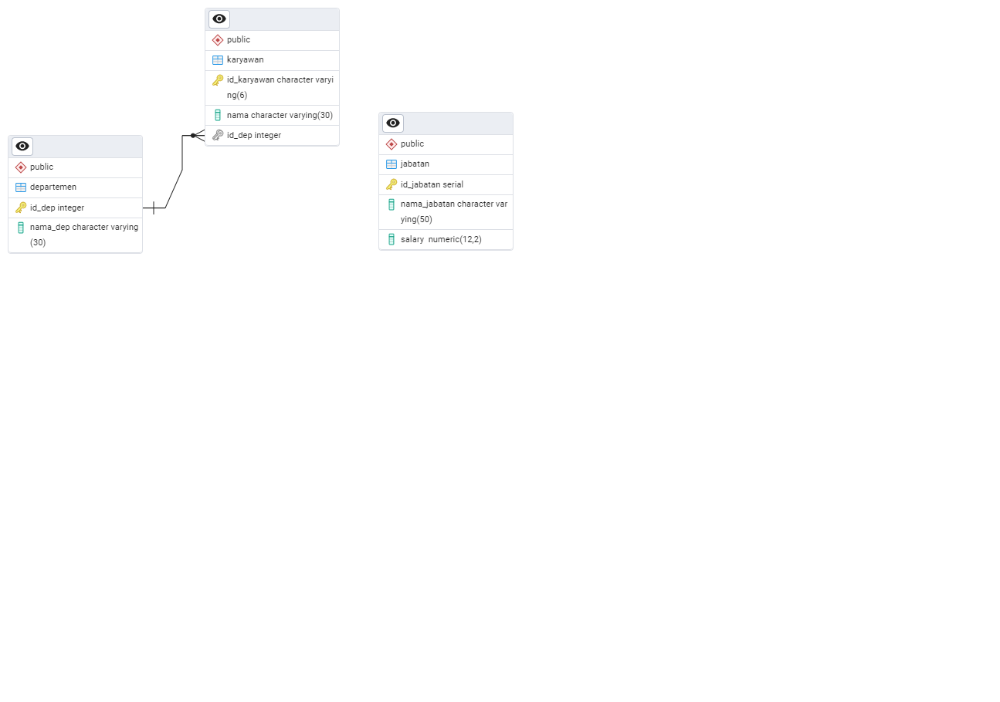

# **Responsi Junior Project**

Benaya Imanuela - 22/494790/TK/54313

## Note

Setelah clone repository, jangan lupa install package Npgsql

## **Aplikasi CRUD Data Karyawan**

Terdiri dari fitur:

1. Menambah data karyawan berupa id, nama karyawan, dan id departemen
2. Mengubah data sesuai dengan id karyawan
3. Menghapus data dari sistem sesuai dengan id karyawan

## **Entity Relational Diagram**



## **Funtion di PostgreSQL**

### **Menambahkan Karyawan**

```
CREATE OR REPLACE FUNCTION add_employee(in_id_karyawan CHAR(6), in_nama CHAR(30), in_id_dep INTEGER)

RETURNS INTEGER AS $$

BEGIN
	IF EXISTS (SELECT 1 FROM karyawan WHERE id_karyawan = in_id_karyawan) THEN
		RETURN 409;
	ELSE
		INSERT INTO karyawan (id_karyawan, nama, id_dep)
		VALUES (in_id_karyawan, in_nama, in_id_dep);
		RETURN 201;
	END IF;
END;
$$ LANGUAGE plpgsql;
```

### **Edit Karyawan**

```
CREATE OR REPLACE FUNCTION edit_employee(in_id_karyawan CHAR(6), in_nama CHAR(30), in_id_dep INTEGER)

RETURNS INTEGER AS $$

BEGIN
	IF EXISTS (SELECT 1 FROM karyawan WHERE id_karyawan = in_id_karyawan) THEN
		UPDATE karyawan
		SET nama = in_nama, id_dep = in_id_dep
		WHERE id_karyawan = in_id_karyawan;
		RETURN 200;
	ELSE
		RETURN 404;
	END IF;
END;
$$ LANGUAGE plpgsql;
```

### **Menghapus Karyawan**

```
CREATE OR REPLACE FUNCTION delete_employee(in_id_karyawan CHAR(6))

RETURNS INTEGER AS $$

BEGIN
	IF EXISTS (SELECT 1 FROM karyawan WHERE id_karyawan = in_id_karyawan) THEN
		DELETE FROM karyawan
		WHERE id_karyawan = in_id_karyawan;
		RETURN 204;
	ELSE
		RETURN 404;
	END IF;
END;
$$ LANGUAGE plpgsql;
```
